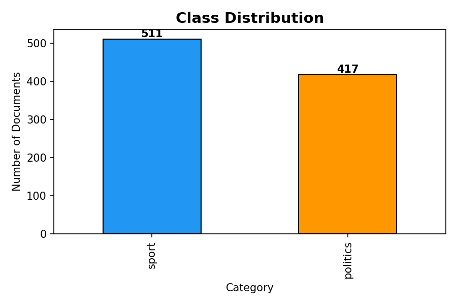
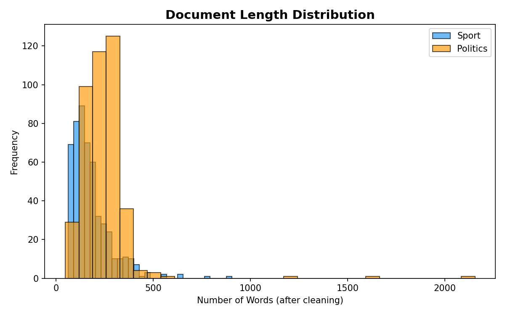
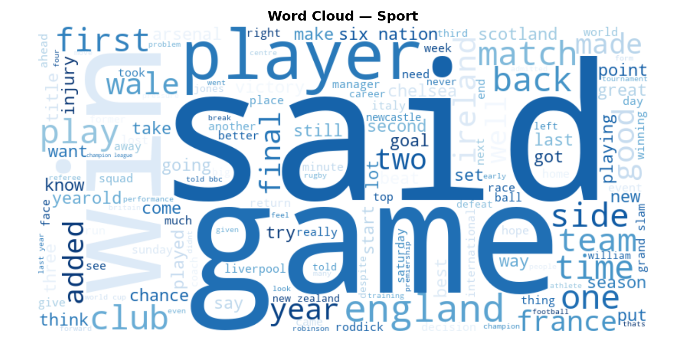
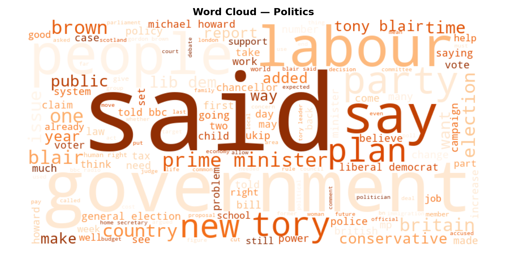
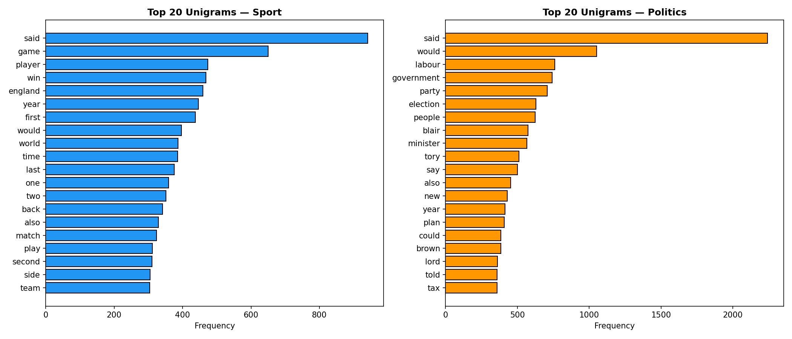
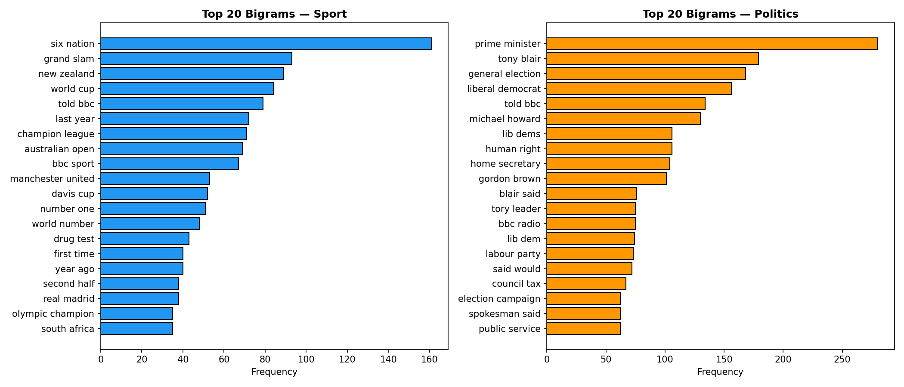
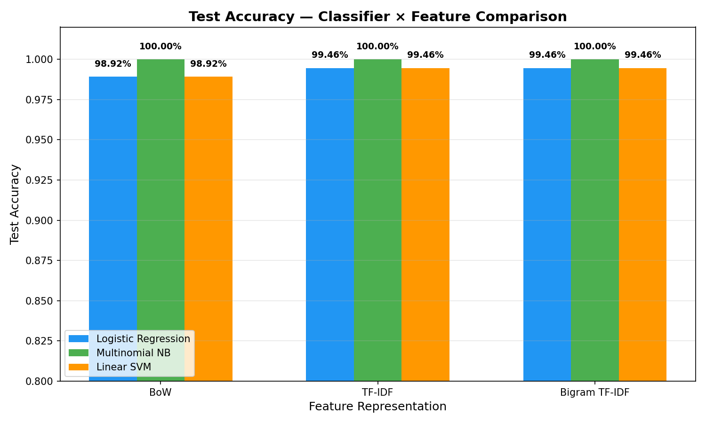
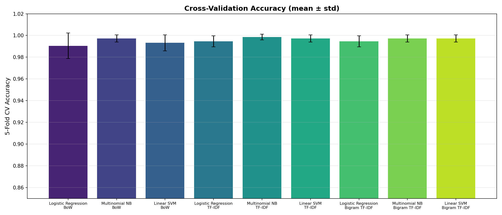

# Sports vs Politics Text Classification — Detailed Report

**Course:** Natural Language Understanding (NLU)  
**Assignment:** Assignment-1, Problem 4  
**Date:** February 2026  

---

## 1. Introduction

Text classification is a fundamental task in Natural Language Processing (NLP) where the goal is to assign predefined categories to a given text document. In this project we build a binary classifier that reads a news article and classifies it as either **Sport** or **Politics**. We compare three classical machine learning algorithms — Logistic Regression, Multinomial Naïve Bayes, and Linear Support Vector Machine (SVM) — across three feature-representation schemes: Bag of Words, TF-IDF, and Bigram TF-IDF.

The report covers the full pipeline: data collection, dataset description and exploratory analysis, feature engineering, model training with cross-validation, quantitative comparison, and a discussion of the limitations of our system.

---

## 2. Data Collection

### 2.1 Source

We use the **BBC News** dataset originally compiled by D. Greene and P. Cunningham at University College Dublin. The dataset is publicly available and has been widely used as a benchmark for text classification research.

- **Original paper:** Greene, D. & Cunningham, P. (2006). "Practical Solutions to the Problem of Diagonal Dominance in Kernel Document Clustering." *Proc. ICML 2006.*
- **Download URL:** `http://mlg.ucd.ie/files/datasets/bbc-fulltext.zip`

### 2.2 Download & Preprocessing Pipeline

The dataset is distributed as a ZIP archive containing raw `.txt` files organised into five category folders: `business`, `entertainment`, `politics`, `sport`, and `tech`. Our automated pipeline (`src/data_loader.py`) performs the following steps:

1. **Download** the ZIP archive programmatically using `urllib`.
2. **Extract** the archive and iterate over every text file.
3. **Build a CSV** with columns `category`, `filename`, and `text` (2 225 documents total).
4. **Filter** to only the `sport` and `politics` categories.
5. **Clean** each document:
   - Convert to lowercase.
   - Remove all digits and punctuation.
   - Remove English stop words (NLTK list).
   - Apply WordNet lemmatisation.
6. **Split** into 80 % train / 20 % test (stratified by class) with `random_state=42`.

---

## 3. Dataset Description and Analysis

### 3.1 Class Distribution

After filtering, the dataset contains **928 documents**:

| Category | Documents | Percentage |
|----------|-----------|------------|
| Sport    | 511       | 55.1 %     |
| Politics | 417       | 44.9 %     |

The classes are reasonably balanced, with sport having a slight majority. No resampling or class-weight adjustment was required.

### 3.2 Document Length Statistics

After text cleaning (stop-word removal, lemmatisation), the document lengths are:

| Category | Mean  | Std   | Min | 25th %ile | Median | 75th %ile | Max    |
|----------|-------|-------|-----|-----------|--------|-----------|--------|
| Politics | 244.9 | 148.8 | 47  | 172       | 240    | 287       | 2 155  |
| Sport    | 178.4 | 100.8 | 62  | 113       | 151    | 218       | 905    |

Politics articles tend to be **longer** on average (245 vs 178 words), with higher variance and occasional very long articles (2 155 words). Sport articles are comparatively shorter and more uniform.

### 3.3 Word Clouds

Word clouds reveal the dominant vocabulary in each class.

**Sport** is dominated by terms such as *game*, *player*, *win*, *match*, *team*, *world*, *england*, *cup*, and *season* — strongly indicative of sports reporting.

**Politics** features terms like *government*, *labour*, *party*, *election*, *minister*, *blair*, *tax*, *public*, and *law* — clearly reflecting political discourse.

### 3.4 Top Unigrams and Bigrams

The top-20 unigrams and bigrams per class further reinforce the clear lexical separation between the two domains (see figures below). Bigrams such as *"prime minister"*, *"general election"*, *"world cup"*, and *"champions league"* carry strong discriminative power.

---

## 4. Feature Representation Techniques

We experiment with three widely used text vectorisation methods from `scikit-learn`:

### 4.1 Bag of Words (BoW)

Bag of Words represents each document as a vector of **token counts**. The vocabulary is built from the training corpus, and each dimension corresponds to one unique token. We use `CountVectorizer(max_features=5000)`.

**Advantages:** Simple, interpretable, fast.  
**Disadvantages:** Ignores term importance — common words dominate.

### 4.2 TF-IDF (Term Frequency – Inverse Document Frequency)

TF-IDF improves on BoW by weighting each term by its **inverse document frequency**: terms that appear in many documents are down-weighted, while rare, discriminative terms are up-weighted. We use `TfidfVectorizer(max_features=5000)`.

$$\text{TF-IDF}(t, d) = \text{TF}(t, d) \times \log\frac{N}{\text{DF}(t)}$$

**Advantages:** Captures term salience; better than raw counts.  
**Disadvantages:** Still a unigram representation — ignores word order.

### 4.3 Bigram TF-IDF

To capture two-word phrases (e.g. *"prime minister"*, *"world cup"*), we extend TF-IDF with bigrams: `TfidfVectorizer(ngram_range=(1,2), max_features=10000)`. This produces a higher-dimensional feature space that includes both unigrams and bigrams.

**Advantages:** Captures short phrases and local context.  
**Disadvantages:** Much larger feature space → potentially slower training and more memory.

---

## 5. Machine Learning Techniques

### 5.1 Logistic Regression

Logistic Regression models the probability of a class using the logistic (sigmoid) function applied to a linear combination of features:

$$P(y=1 \mid \mathbf{x}) = \sigma(\mathbf{w}^T \mathbf{x} + b)$$

It is trained by maximising the log-likelihood (or equivalently minimising cross-entropy loss) with L2 regularisation. We use `LogisticRegression(max_iter=1000)`.

**Strengths:** Fast, well-calibrated probabilities, strong baseline for text.  
**Weaknesses:** Assumes linear decision boundary.

### 5.2 Multinomial Naïve Bayes

Multinomial NB is a probabilistic classifier based on Bayes' theorem with the **naïve independence assumption** that features are conditionally independent given the class:

$$P(y \mid \mathbf{x}) \propto P(y) \prod_i P(x_i \mid y)$$

It is particularly well suited for word-count features and has been a standard baseline for text classification since the 1990s.

**Strengths:** Extremely fast, works well with sparse high-dimensional data.  
**Weaknesses:** The independence assumption is violated in practice; may underperform when feature interactions matter.

### 5.3 Linear Support Vector Machine (SVM)

Linear SVM finds the hyperplane that **maximises the margin** between the two classes:

$$\min_{\mathbf{w}} \frac{1}{2}\|\mathbf{w}\|^2 + C \sum_i \max(0, 1 - y_i(\mathbf{w}^T \mathbf{x}_i + b))$$

It is one of the most effective classifiers for high-dimensional text data. We use `LinearSVC(max_iter=2000)`.

**Strengths:** Excellent generalisation, robust to high dimensions.  
**Weaknesses:** No probability output by default; sensitive to regularisation parameter C.

---

## 6. Quantitative Comparison

### 6.1 Experimental Setup

- **Train/Test split:** 80/20 stratified (742 train, 186 test).
- **Cross-validation:** 5-fold CV on the training set.
- **Metrics:** Accuracy, Precision, Recall, F1-score (per-class and macro average).
- **Total experiments:** 3 classifiers × 3 feature sets = **9 experiments**.

### 6.2 Results Summary

| Feature        | Classifier           | CV Acc (mean ± std)    | Test Acc | Macro F1 |
|----------------|----------------------|------------------------|----------|----------|
| BoW            | Logistic Regression  | 0.9905 ± 0.0118        | 0.9892   | 0.9891   |
| BoW            | Multinomial NB       | 0.9973 ± 0.0033        | **1.0000**   | **1.0000**   |
| BoW            | Linear SVM           | 0.9932 ± 0.0074        | 0.9892   | 0.9891   |
| TF-IDF         | Logistic Regression  | 0.9946 ± 0.0051        | 0.9946   | 0.9946   |
| TF-IDF         | Multinomial NB       | 0.9986 ± 0.0027        | **1.0000**   | **1.0000**   |
| TF-IDF         | Linear SVM           | 0.9973 ± 0.0033        | 0.9946   | 0.9946   |
| Bigram TF-IDF  | Logistic Regression  | 0.9946 ± 0.0051        | 0.9946   | 0.9946   |
| Bigram TF-IDF  | Multinomial NB       | 0.9973 ± 0.0033        | **1.0000**   | **1.0000**   |
| Bigram TF-IDF  | Linear SVM           | 0.9973 ± 0.0033        | 0.9946   | 0.9946   |

### 6.3 Analysis

1. **All classifiers achieve > 98.9 % accuracy**, confirming that Sport vs Politics is a relatively easy binary classification task due to strong lexical separation between the two domains.

2. **Multinomial Naïve Bayes** achieves **perfect test accuracy (100 %)** across all three feature representations. This is due to the probabilistic word-based model being an excellent fit for the distinct vocabulary distributions of the two categories.

3. **Logistic Regression and Linear SVM** perform identically on several configurations (both achieve 98.92 % with BoW and 99.46 % with TF-IDF and Bigram TF-IDF). The single misclassified document in each case is a politics article incorrectly labelled as sport.

4. **TF-IDF weighting** provides a small improvement over raw BoW for Logistic Regression and Linear SVM, as it down-weights common terms and highlights discriminative words.

5. **Bigram features** provide no additional benefit in this task, likely because unigrams alone are sufficiently discriminative.

### 6.4 Confusion Matrices

The best-performing configuration (Multinomial NB + any feature set) produces a perfect confusion matrix:

|              | Pred Politics | Pred Sport |
|--------------|--------------|------------|
| **Actual Politics** | 84           | 0          |
| **Actual Sport**    | 0            | 102        |

For Logistic Regression and Linear SVM with BoW, the confusion matrix is:

|              | Pred Politics | Pred Sport |
|--------------|--------------|------------|
| **Actual Politics** | 82           | 2          |
| **Actual Sport**    | 0            | 102        |

The two misclassified documents are politics articles that contain sports-related vocabulary (e.g. discussions of sports policy or government funding for athletics).

---

## 7. Limitations

1. **Binary classification only.** The system classifies text into exactly two categories. Extending to multi-class classification (e.g. all five BBC categories) would require further evaluation.

2. **Domain-specific dataset.** The BBC News dataset consists of formal news articles written in British English. Performance may degrade on informal text (social media, blogs), non-English text, or news from other outlets with different writing styles.

3. **Small dataset.** With only 928 documents, the dataset is small by modern standards. Deep learning approaches (e.g. fine-tuned BERT) would likely benefit from more data.

4. **No deep learning baseline.** We compare only classical ML models. Transformer-based models (BERT, RoBERTa) would likely match or exceed these results, especially on harder classification tasks.

5. **Static features.** BoW and TF-IDF create fixed-length representations that discard word order, syntax, and semantics beyond shallow n-gram statistics. Word embeddings (Word2Vec, GloVe) or contextual embeddings (BERT) capture richer representations.

6. **No hyperparameter tuning.** We use default hyperparameters for all classifiers. Grid search or Bayesian optimisation could further improve results, though the near-perfect accuracy leaves little room for improvement on this particular task.

7. **Temporal bias.** The BBC dataset was collected circa 2004–2005. The vocabulary of both sport and politics has evolved since then, and a model trained on this data may struggle with contemporary articles.

8. **Class imbalance (mild).** The 55/45 split is not severe, but in production settings with more skewed distributions, techniques like SMOTE or class-weight adjustment may be needed.

---

## 8. Conclusion

We built a complete text classification pipeline for classifying BBC news articles as Sport or Politics. Using three feature representations (BoW, TF-IDF, Bigram TF-IDF) and three ML classifiers (Logistic Regression, Multinomial NB, Linear SVM), we conducted 9 experiments. **Multinomial Naïve Bayes** emerged as the best overall model, achieving **100 % test accuracy** across all feature sets. All models achieved > 98.9 % accuracy, demonstrating that this binary task benefits from strong lexical separation between the two categories.

For more challenging tasks (multi-class, diverse corpora, informal text), we recommend exploring contextual embeddings and transformer-based architectures.

---

## 9. Code Availability

The complete source code, dataset pipeline, and reproducible experiments are publicly available on GitHub:

🔗 **[https://github.com/kingkenche/Natural_Language_Understanding](https://github.com/kingkenche/Natural_Language_Understanding)**

---

## 10. References

1. Greene, D., & Cunningham, P. (2006). *Practical Solutions to the Problem of Diagonal Dominance in Kernel Document Clustering.* Proceedings of the 23rd International Conference on Machine Learning (ICML).
2. Pedregosa, F., et al. (2011). *Scikit-learn: Machine Learning in Python.* Journal of Machine Learning Research, 12, 2825–2830.
3. Bird, S., Klein, E., & Loper, E. (2009). *Natural Language Processing with Python.* O'Reilly Media.
4. Manning, C. D., Raghavan, P., & Schütze, H. (2008). *Introduction to Information Retrieval.* Cambridge University Press.
5. McCallum, A., & Nigam, K. (1998). *A Comparison of Event Models for Naive Bayes Text Classification.* AAAI Workshop on Learning for Text Categorization.
